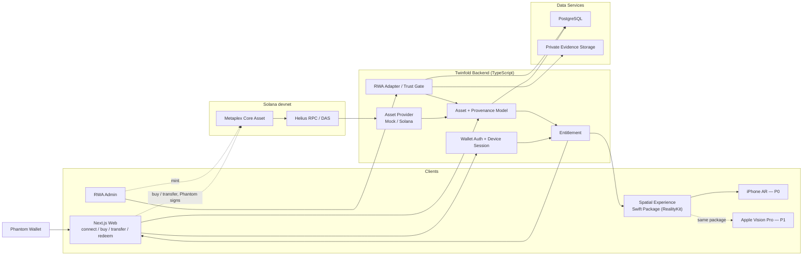
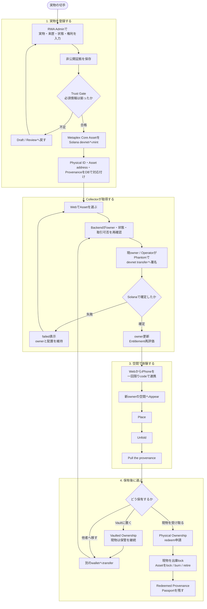
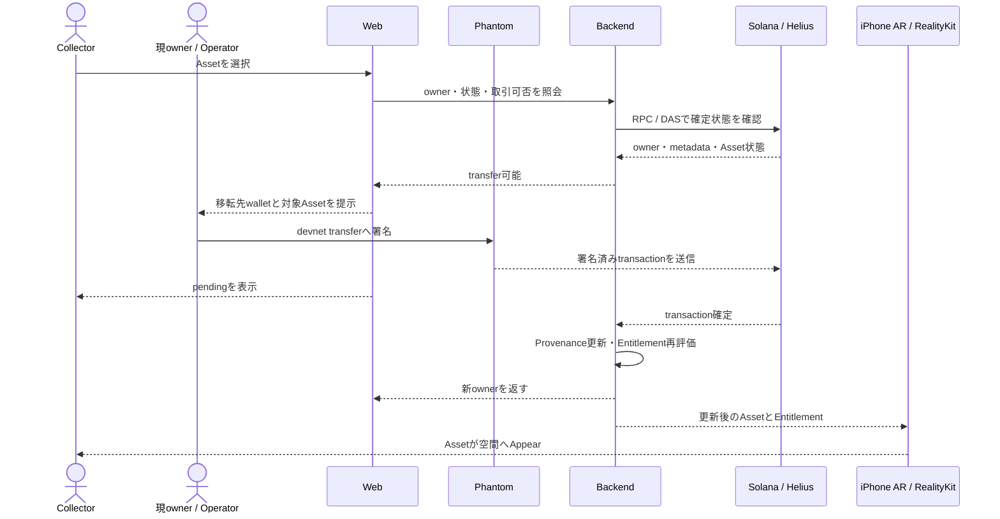

# Twinfold Technical Architecture

> ステータス: Colosseum MVP技術ベースライン
> 最終更新: 2026-09-08

この文書は、MVPの責務境界、共通データ、同期、安全性の技術ベースラインを定義する。合格基準は [MVP Acceptance Criteria](./mvp.md)、実装順と日程は [Build Order](./build-order.md) を正とする。共通型の実体は散文ではなくコード（`apps/web` 側の共有型定義）を正とし、この文書は形・不変条件・境界だけを示す。E2Eフローと契約の詳細を二重管理しないため、Development Plan からはこの文書を参照する。

## 1. 技術目標

Solana上の所有・移転・来歴を共通モデルへ変換し、次の状態変化として体験できるようにする。

```text
Asset取得 → 空間へPlace → ProvenanceをPull
→ transfer → Entitlement再評価
→ 旧所有者からDisappear → 新所有者へAppear
```

Spatial ClientはSwiftUI + RealityKitを共通実装（Swift Package `TwinfoldCore`／`TwinfoldSpatial`）とし、MVPのPrimary ClientはiPhone ARとする。ARKitなどplatform固有処理は `apps/ios` のAdapterへ隔離し、Apple Vision Pro（`apps/visionos`）は同じPackageを使うHero／secondary clientとして扱う。2026-09-18にUnity + AR FoundationからSwiftUI + RealityKitへ切り替えた。

- P0: SwiftUI + RealityKit + ARKit（iPhone、`apps/ios`）
- P1: 同じSwift Packageを使うvisionOS app（`apps/visionos`）+ Apple Vision Pro
- Post-MVP: Meta Quest、Android（UnityかWebXRかはその時点で再検討）

Post-MVP対応のための共通化で、iPhoneのPrimary E2Eを遅らせない。

## 2. システム全体像

コンポーネントと主要なデータフローだけを示す。各要素の決定・準備状況は下の「サービス選定状況」を正とし、図には重複させない。



### 2.1 フロー別の動き

全体図を実際の操作へ落とすと、次の流れになる。各フローでは「入口」「Backendで行うこと」「外部サービス」「完了状態」を分けて考える。

> MVPの `buy` は本番決済を意味しない。P0では取得操作を起点にSolana devnet上でAssetを移転し、所有者変更後の体験までを検証する。USDC purchaseは、支払いとAsset移転をatomicに実装できた場合だけ追加する。

#### End-to-Endフロー図



図の読み方:

- **登録前半**はOperatorの仕事で、Trust Gateに通るまでmintしない。
- **取得中央**はWeb、Backend、Phantom、Solanaを通り、chain確定後にだけownerを更新する。
- **空間体験**はBackendが返すEntitlementを入口にし、Spatial ClientからSolanaを直接呼ばない。
- **保有後**は、Vault保管の継続、別ownerへのtransfer、現物を受け取るredeemの3方向に分かれる。

#### システム間の購入／取得シーケンス



#### A. 初回利用と端末連携

```text
WebでPhantomを接続
→ Backendがnonceを発行
→ Phantomでログイン用messageへ署名
→ Backendが署名を検証しWeb sessionを発行
→ Webが一回限りのlink codeを発行
→ iPhone ARがcodeをBackendと交換
→ 端末用sessionを発行
→ そのwalletに表示権があるAssetだけを返す
```

- Phantomの秘密鍵はWeb、Backend、iPhoneへ保存しない。
- wallet addressを入力しただけでは所有者向け機能を有効にしない。
- link codeは短時間・一回限りとし、端末sessionは個別に失効できるようにする。

#### B. 実物の登録、確認、mint

```text
OperatorがRWA Adminで実物情報を入力
→ Physical IDを発行
→ 来歴・状態・画像利用権・物理所有権・著作権・保管情報を登録
→ 非公開証拠の原本をPrivate Evidence Storageへ保存
→ 公開可能なmetadataとevidence hashをPostgreSQLへ保存
→ Trust Gateが必須項目を検査
→ 合格した場合だけMetaplex Core Assetをdevnetへmint
→ transaction確定後、Asset addressとmint eventを共通モデルへ同期
→ `rwa_verified` と `minted` をProvenanceへ追加
```

登録に必要な最小項目:

| 分類 | 内容 | 保存先 |
|---|---|---|
| 識別 | Physical ID、作品名、カテゴリ、寸法、管理番号 | PostgreSQL |
| 来歴 | 取得元、過去の移動、確認者、確認日時 | PostgreSQL + 証拠原本 |
| 状態 | 傷・劣化、撮影記録、最終確認日時 | PostgreSQL + 証拠原本 |
| 権利 | 物理所有権、画像利用許諾、著作権の所在と範囲 | PostgreSQL + 非公開契約資料 |
| 保管 | Vault、保管位置、custody status | PostgreSQL |
| 表示素材 | XR用画像／3D素材、公開可否 | Private Storage + 短期署名URL |
| オンチェーン対応 | network、Asset address、mint transaction | Solana + PostgreSQL |

必須情報が欠ける場合はdraftまたはreview状態に留め、`rwa_verified` とmintを実行しない。オンチェーンmetadataへ個人情報、契約書、高精細原本、詳細な保管位置を載せない。

#### C. 取得／購入相当操作

```text
CollectorがWebでAssetを選ぶ
→ WebがBackendへ現在owner・Asset状態・取引可否を照会
→ BackendがSolana RPC／DASで確定状態を再確認
→ 現ownerまたはOperatorがPhantomでdevnet transferへ署名
→ Metaplex Core AssetのownerがCollector walletへ移る
→ Backendがtransactionを検知して`transferred` eventへ正規化
→ PostgreSQLのowner／Provenanceを更新
→ Entitlementを再評価
→ WebとiPhone ARが更新を取得
→ 新ownerの空間へAssetがAppearし、旧ownerからDisappear
```

- Webは署名前に、対象Asset、現在owner、移転先、network、transactionの目的を署名者へ表示する。
- P0の取得では現ownerまたは管理用devnet walletが移転へ署名する。Collector自身が未所有Assetをtransferすることはできない。
- 署名直後は `pending`、chain確定後だけ `confirmed` と表示する。
- MVPで金銭を送るだけの操作を「購入完了」と呼ばない。本番購入では、決済成功とAsset移転が一体で失敗・再試行できる取引設計が別途必要になる。

#### D. Spatialでの表示と来歴体験

```text
iPhone ARが端末sessionでBackendへAsset一覧を要求
→ Backendがsession、chain owner、Asset状態、display rightsを検査
→ Entitlementと共通Asset Modelを返す
→ 表示素材は短期署名URLで取得
→ RealityKitがAssetを表示
→ CollectorがPlace
→ UnfoldでOwnership／Provenance／Evidence／Physicalを開く
→ Pullでmint・verification・transfer等のEventを時系列表示
```

Spatial ClientはBackendだけを参照し、Solana RPCや非公開証拠storageを直接呼ばない。Evidence画面ではオンチェーン事実、オフチェーン証拠、Twinfoldによる解釈を視覚的に区別する。

#### E. owner間transfer

```text
現ownerがWebで移転先walletを入力
→ BackendがAsset状態と移転可否を再確認
→ Phantomがtransfer transactionへ署名
→ Web／Spatialは`pending`を表示
→ Solana確定後、BackendがownerとProvenanceを更新
→ 旧ownerのEntitlementをfalseへ変更し保存済み配置を無効化
→ 新ownerのEntitlementをtrueへ変更
→ 旧ownerからDisappear、新ownerへAppear
```

transaction失敗時はownerと配置を維持し、`failed` と再試行導線を表示する。Webhook未達時も定期再照会で収束させ、transfer確定から表示失効までは5分以内をMVP基準とする。

#### F. Vaulted Ownershipの継続

```text
ownerがWebでVaulted Ownershipを選ぶ
→ Backendがchain ownerとVault保管状態を確認
→ RWA Adapterがholding modeを記録
→ `vaulted` eventをProvenanceへ追加
→ Assetはactiveのまま
→ ownerはXR表示と将来のtransferを継続できる
```

現物はVaultから動かさず、オンチェーンownerだけを移転できる。保管状態に例外が出た場合はAssetを `exception` として表示停止し、解消までtransfer／redeemを許可しない。

#### G. Physical Ownership、redeem、配送ドライラン

```text
ownerがWebでPhysical Ownershipを選びredeemを申請
→ Backendが署名済みsession、chain owner、未redeem、未申請を再確認
→ 配送先をwallet・分析データと分離して保存
→ RWA Adapterが対象実物を出庫lock
→ MVPでは梱包・保険・配送をdry runとして記録
→ 出庫条件成立後、流通Assetをlock／burn／retire
→ `redeemed` eventとPassportを生成
→ 通常のEntitlementを失効
→ Redeemed Provenance Passportへの条件付き閲覧だけを残す
```

- Asset失効と出庫の順序は二重流通が起きないよう冪等に処理し、同じ申請を二重実行しない。
- PassportはVault退出までの来歴と最終確認状態を示すが、配送後の現在owner、現在状態、真正性、著作権を継続保証しない。
- MVPでは実配送・保険契約を行わず、画面と記録上でのdry runであることを明示する。

#### H. 同期遅延・不一致・失敗時

```text
Webhookまたはpollingで更新を検知
→ transaction signatureで重複を排除
→ RPC／DASの確定状態とDBを比較
→ 一致すればowner、Provenance、Entitlementを更新
→ 一時的不一致なら再試行し`pending`を維持
→ 不一致が継続したら`exception`へ移行
→ Web／Spatialで表示を止め、Adminの確認対象にする
```

cacheやWebhookは高速化のために使い、所有権判定の正にはしない。再処理しても同じ最終状態になるよう、mint、transfer、redeemの各処理はtransaction signatureまたはrequest IDで冪等化する。

### 2.2 フローと責務の対応

| フロー | 主な操作主体 | 入口 | Backend／RWA | Solana | 最終状態 |
|---|---|---|---|---|---|
| 初回利用 | Collector | Web + Phantom | 認証、session、端末連携 | 署名検証用address | Web／iPhoneが同じwalletへ安全に接続 |
| 実物登録 | Operator | RWA Admin | Physical、Evidence、Rights、Trust Gate | 合格後にmint | 実物とdevnet Assetが対応 |
| 取得 | Collector | Web | 状態確認、同期、Entitlement更新 | owner transfer | 新ownerがWeb／Spatialで利用可能 |
| Spatial体験 | Collector | iPhone AR | Entitlement、共通モデル、署名URL | Backend経由で反映 | Place／Unfold／Pullが可能 |
| 再移転 | 現owner | Web + Phantom | pending管理、owner同期、権利再評価 | transfer | 旧ownerから消え新ownerへ現れる |
| Vault継続 | owner | Web | holding mode、custody確認 | Assetはactive | 現物を動かさず流通継続 |
| redeem | owner | Web | owner再確認、出庫lock、Passport | lock／burn／retire | 二重流通を止め、履歴を残す |
| 例外対応 | System／Operator | Backend／Admin | retry、監査、表示停止 | RPC／DAS再照会 | 不整合時は安全側へ倒す |

### サービス選定状況

| 領域 | MVPで使うもの | 状態 | 補足 |
|---|---|---|---|
| Web application | Next.js 16／React 19／TypeScript | 実装済み | `apps/web`。wallet、比較Timeline、端末連携、RWA管理を担当 |
| Web hosting | Cloudflare Pages | 利用予定 | アカウントとPages利用は確認済み。deploy設定は未実装 |
| Wallet | Phantom | 決定・準備済み | 開発専用walletをSolana devnetで使用 |
| Solana data | Helius | 決定・準備済み | RPC、DAS、transaction取得、必要に応じてWebhook |
| Asset standard | Metaplex Core | 決定 | devnetでmint／transferする |
| Backend API | TypeScript／Node.js REST API | 技術方針のみ決定 | Hosting serviceは未選定 |
| Database | PostgreSQL | 技術方針のみ決定 | Providerは未選定 |
| Private evidence | 非公開object storage | 未選定 | Cloudflare R2は候補。権利資料と高精細原本は公開しない |
| Primary Spatial client | SwiftUI + RealityKit + ARKit | 決定（2026-09-18にUnityから変更） | `packages/TwinfoldCore` をiOSとvisionOSで共有。`apps/ios` がARKit Adapter |
| MVP device | iPhone／iOS | 決定 | Primary E2E、第三者テスト、比較検証に使用 |
| Hero client | Apple Vision Pro + SwiftUI + RealityKit | P1 | 既存 `apps/visionos` prototypeを活用。Primary E2Eを遅らせない |
| iOS distribution | Development BuildまたはTestFlight | 未決定 | 9月13日までにApple Developer Programを含めて判断 |

「未選定」は実装済みを意味しない。サービス決定後は [外部サービス・アカウント台帳（Notion）](https://app.notion.com/p/3de2b198e4f4810e9854daf4794dc916) とこの表を同時に更新する。

## 3. 責務境界

### Web Client

- ウォレット署名認証
- Asset一覧と比較用Provenance Timeline
- iPhoneへの一回限りの端末連携
- transfer、Vaulted／Physical Ownership、redeem
- Trust、Physical情報、Passportの表示

### Spatial Experience（Swift Package）

- Platform非依存のPlace、Unfold、Pull
- ownership状態に応じたAppear／Disappear
- `pending`、`confirmed`、`failed` の表現
- Backendの共通モデルだけを解釈し、Solana RPCを直接呼ばない
- 購入、秘密鍵管理、配送先入力を行わない

### Platform Adapter

- iOS／ARKitのcamera、camera-relative anchor、touch（tap／drag／pinch）、Lifecycle
- Platform固有API（ARKit）をSpatial Experienceから隔離
- MVPではiOS Adapterのみ実装
- Vision Pro、Quest、Androidは同じCore Modelを使うsecondary／将来の差し替え先

### Twinfold Backend

- 署名認証とDevice Session
- Asset／Eventの正規化
- ownerと表示権の判定
- Web／Spatialへの共通API
- chain同期、再試行、監査

### RWA Adapter

- Physical Asset、証拠、権利、Vaultの記録
- Trust Gate、redeem、Asset失効、Passport
- オンチェーン事実とオフチェーン証拠の分離

切手などvertical固有の保存・鑑定書・画像権利要件はRWA Adapter内に置き、Coreへ埋め込まない。

## 4. 共通モデル

```ts
type TwinfoldAsset = {
  id: string;
  network: "devnet";
  address: string;
  standard: string;
  owner: string | null;
  title: string;
  display: DisplayDescriptor;
  provenance: ProvenanceEvent[];
  physical?: PhysicalDescriptor;
};

type ProvenanceEvent = {
  id: string;
  assetId: string;
  kind: ProvenanceKind;
  occurredAt: string;
  source: "onchain" | "offchain_evidence" | "twinfold_interpretation";
  status: "pending" | "confirmed" | "failed";
  transaction?: string;
  slot?: number;
  evidenceHash?: string;
  metadata: Record<string, unknown>;
};

type Entitlement = {
  wallet: string;
  assetId: string;
  canDisplay: boolean;
  reason: string;
  checkedAt: string;
};
```

`ProvenanceKind` はMVPで扱う範囲だけを実装する。

- MVP必須: `minted` / `transferred` / `rwa_verified` / `vaulted` / `redeemed`
- Post-MVP: `frozen` / `burned` / `condition_updated` / `passport_issued`

`id` はTwinfold内部の安定ID、`address` は外部識別子とする。UIでは `onchain`、`offchain_evidence`、`twinfold_interpretation` を混同しない。

## 5. Asset Provider

`MockAssetProvider` と `SolanaAssetProvider` は同じinterfaceを実装する。

```ts
interface AssetProvider {
  readonly isDemoData: boolean; // fixture由来ならtrue。UIはDEMO DATA／DEVNETをこれで切り替える
  getAssets(wallet: string): Promise<TwinfoldAsset[]>;
  getAsset(assetId: string): Promise<TwinfoldAsset>;
  refreshOwnership(assetId: string): Promise<Entitlement>;
}
```

- Experience Sketchは固定fixtureを返す `MockAssetProvider` を使う
- Solana Connectionでは入力元だけを `SolanaAssetProvider` へ差し替える
- WebとSpatial Clientで別々のfixtureやEvent解釈を持たない
- fixtureは `DEMO DATA`、実接続は `DEVNET` と表示する

## 6. Solana同期

入力はMetaplex Asset、RPC／DASのowner・metadata、transactionとする。

1. transaction signatureで重複処理を防ぐ
2. RPC／DASへ確定済み状態を再照会する
3. transactionを `ProvenanceEvent` へ正規化する
4. ownerとProvenanceを更新する
5. Entitlementを再評価する
6. WebとSpatial Clientへ通知する
7. 不一致が続くAssetは `exception` として表示停止する

Webhookやcacheは表示高速化に使えるが、所有権判定の正にはしない。transfer後の表示失効は5分以内をMVP基準とする。

## 7. 認証・端末連携・Entitlement

### Web署名

1. Backendが期限付きnonceを発行
2. ユーザーがdomain、purpose、nonce、期限を含むmessageへ署名
3. Backendが署名とwalletを検証
4. nonceを使用済みにして短期sessionを発行

### Web → iOS AR

1. 認証済みWebが一回限り・短時間有効のlink codeを発行
2. iOS appがuniversal linkまたは入力codeをBackendと交換
3. Backendが端末固有・失効可能な短期sessionを発行

秘密鍵をiOS appへコピーしない。公開addressの入力だけでは所有者限定操作を許可しない。Vision Pro Hero Demoも同じ原則に従う。

```text
canDisplay =
  authenticated session
  AND chain owner matches wallet
  AND asset is active
  AND display rights are valid
  AND asset is not frozen / redeemed / exception
```

表示画像は短期署名URLで配信する。取得済みデータを端末から完全回収できないことは制約として明記する。

## 8. Spatial Interaction

| Interaction／Event | 空間表現 |
|---|---|
| Acquire／mint | Assetが空間に現れる |
| Place | 所有Assetを自分の空間へ置く |
| Unfold | Experience、Ownership、Provenance、Evidence、Physicalを段階表示する |
| Pull | 時系列のEvent nodeをAssetから引き出す |
| transfer pending | 移転処理中であることを表示する |
| transfer confirmed | 旧所有者から消え、新所有者へ現れる |
| transfer failed | 配置を維持し、失敗と再試行を表示する |
| redeemed | 流通Assetを閉じ、Passportへ履歴を残す |

XR表現をオンチェーン確定より先に確定表示しない。owner変更時は旧所有者の保存済み配置も無効化する。

## 9. RWA Reference

最低1点のReference Assetで以下を接続する。

- Physical ID、状態、最終確認日時
- 取得・来歴・状態の証拠
- 画像利用権、物理所有権、著作権
- Vault、保管状態
- Vaulted／Physical Ownership
- redeem、配送ドライラン、Asset失効
- Redeemed Provenance Passport

Trust Gateの必須項目が揃うまで `rwa_verified` を発行しない。redeem時はRPCでownerを再確認し、二重申請を防止してから流通Assetを失効またはburnする。

PassportはVault退出時点までの履歴を示す。配送後の現在所有者、現在状態、真正性、著作権を保証しない。

## 10. データとセキュリティ

| 項目 | MVP方針 |
|---|---|
| API | TypeScript／Node.jsのREST API |
| DB | PostgreSQL |
| Chain | Solana devnetのみ |
| Public metadata | 公開可能な情報とhash |
| Private evidence | 暗号化した非公開storage |
| Display asset | Entitlement確認後の短期署名URL |

- 個人情報、秘密鍵、非公開画像をlogへ出さない
- 配送先をwallet・分析データから分離する
- nonce再利用と署名replayを防止する
- owner cacheだけで権利を付与しない
- RWA管理操作にrole別認可と監査logを持つ
- 権利失効後は新しい画像URLを発行しない
- devnetと将来のmainnetを設定・credential・DB上で分離する

## 11. 観測

Primary E2Eを説明できる最小限のProduct Event:

- `wallet_authenticated`
- `device_linked`
- `asset_placed`
- `provenance_pulled`
- `ownership_transferred`
- `entitlement_revoked`

RWA Layer接続時（Week 3以降）に追加: `rwa_physical_layer_opened`、`holding_mode_selected`、`passport_opened`

必須技術指標:

- Asset／履歴取得成功率
- transfer確定からEntitlement失効までの時間
- Eventの重複・取りこぼし
- iOS session／AR session／同期成功率
- 必須E2Eの連続成功回数

Week 3以降に追加: RWA整合性例外数。Vision Pro Hero Demo成功率はP1として分けて記録する。

## 12. MVP外と未決事項

MVP外:

- Vision Proの本番品質Build
- Meta Quest、Androidの製品Build
- mainnet、本番決済、実配送、re-vault
- Discovery Graph、Commerce、オファー
- 公開SDK／APIと複数RWAカテゴリ

実装前に確定する事項:

- Solana transactionから復元するEvent範囲とRPC／DAS provider
- Spatial ClientとBackend間のAPI schemaおよび更新通知方式
- ARKitの永続anchor、対応iPhone範囲
- TestFlightを使うか、対面Development Buildに限定するか
- Vision Pro Hero Demoへ同じAssetを接続する範囲
- Passportの記録形式とtransfer不能性
- 切手の画像利用可否、鑑定書の扱い、保管、配送の運用責任
